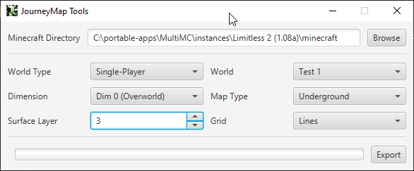

# JourneyMap Tools

This repository contains a small toolkit for manipulating your generated maps without actually starting up Minecraft.

  

# Contributing

We're huge fans of the open source community, and we're happy to accept pull requests. That said, we would prefer
that you [join the discord server](https://discord.gg/eP8gE69) and have a chat with us about it first. This allows
us to cooperate with you and ensure that your PR makes sense, and isn't stepping on anyone else's toes.

Please also take a look at the [Code of Conduct](CONDUCT.md) before posting an issue, PR or comment.

# Setting Up

We provide a standalone JAR download, and an installer for Windows. Please note that if you pick the standalone JAR, 
you will need to have **Java 11 or later** installed.

**This toolkit only supports 64-bit systems!**

## Installer (Windows only)

This installer contains a copy of the Java runtime, so you don't need to install it yourself.

1. Head to the [releases page](https://github.com/TeamJM/journeymap-tools/releases) and download the installer for the latest version.
2. Run the installer. If Microsoft SmartScreen pops up, click on the `More Info` link, and then the
   `Run anyway` button at the bottom.
3. Once installed, you will find a `JourneyMap Tools` shortcut on your desktop, and in your start menu. Use that
   to start the toolkit.

## Standalone JAR (all platforms)

1. Head to the [releases page](https://github.com/TeamJM/journeymap-tools/releases) and download the JAR for the latest version.
2. Save the JAR in its own folder, and create a shortcut to it on your desktop (or somewhere else within easy reach).
3. Double-click the JAR or shortcut to start the toolkit.

**Note:** On Linux, you may need to create a launcher that makes use of the `java` command directly. This will
depend on how you have configured your desktop.

# Usage

Upon launch, you will be presented with a window that looks like this:

  

## Selecting your instance

The first thing to do is to tell the tool where you've placed your Minecraft instance. If you're using a modpack
then this is likely to be managed by your launcher, and you should be able to locate the instance directory from there.

The default vanilla Minecraft installation directory will be selected for you, but if this is incorrect then you can 
click on `Browse` to navigate to the right directory. You can also type or copy-and-paste the path - in that case, 
please hit `Enter` on your keyboard to confirm the location.

If the tool was unable to detect a valid JourneyMap data directory within the selected Minecraft directory, the
location input will be coloured red. Ensure that you select a Minecraft installation that has been used with
JourneyMap at least once.

## Settings

Once you've selected the correct Minecraft installation directory, you'll be able to choose which world you want
to work with, and configure the map.

* **World Type**: The type of world you want to work with.
    * **Single-Player**: Worlds that you've played in single-player mode.
    * **Multi-Player (Online)**: Servers that you've played on while logged into Minecraft.
    * **Multi-Player (Offline)**: Servers that you've played on while in offline mode.
* **World**: The name of the world/server you wish to work with.
    * If you're choosing a server, JourneyMap may have created multiple directories for it. This can happen due
      to multiple servers existing with the same name, or due to file permissions errors. Feel free to give each
      one a try, or inspect the folders yourself if you're not sure.
* **Dimension**: The dimension within the selected world you wish to work with.
    * If you don't see any dimensions in the list, then you simply don't have any maps for those dimensions. Start
      up the game, explore a bit, and try again!
* **Map Type**: The type of map you wish to work with.
    * These correspond with the standard JourneyMap map types - day, night, topographic and underground.
    * If you don't see a map type in this list, then you simply haven't mapped any chunks using that map type.
* **Surface Layer**: When using the "Underground" map type, this is the vertical slice you wish to work with.
    * JourneyMap maps underground areas in layers. You may wish to experiment with cave mode in the full-screen
      map to figure out which layer you wish to work with.
    * This option will only show layers that you've mapped at least one chunk for.
* **Grid**: Whether you wish to draw a grid representing individual chunks over the map. 

## Exporting

Once you're happy with your settings, click on the `Export` button and pick somewhere to save your map. Once you've
done this, all you need to do is sit back and wait for the map to be exported!

# Problems?

If you're trying to open the toolkit and nothing is happening, then you're probably running it with the wrong version
of Java.

1. Ensure that you have **Java 11 or later** installed, or that you're using the Windows installer.
2. Ensure that your system's default version of Java is Java 11.
3. Try running the standalone JAR from a terminal - `java -jar JMTools.jar`

If you think you've found a problem, feel free to [contact us on Discord](https://discord.gg/eP8gE69) or head
to [the issues page](https://github.com/TeamJM/journeymap-tools/issues) and open an issue.
